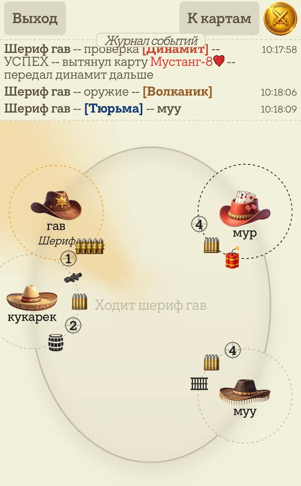
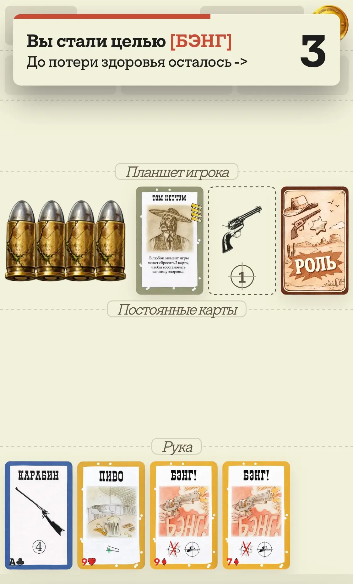
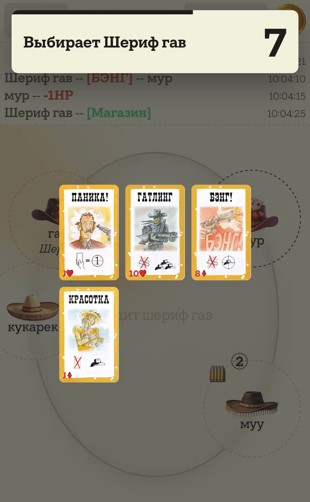
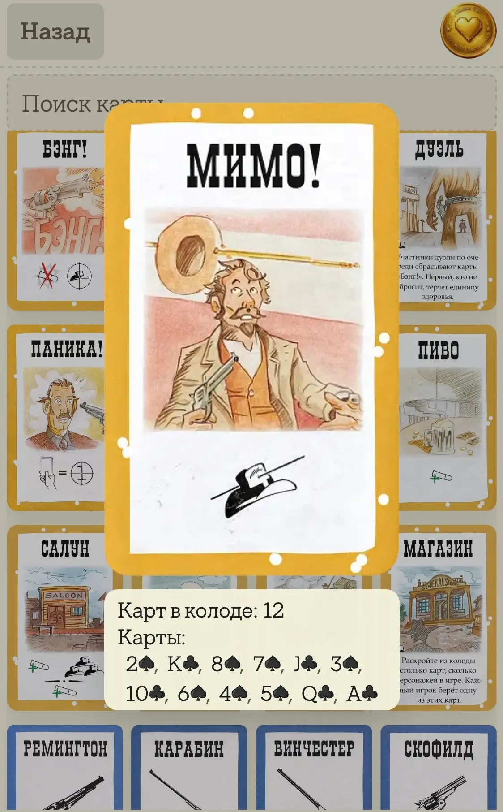
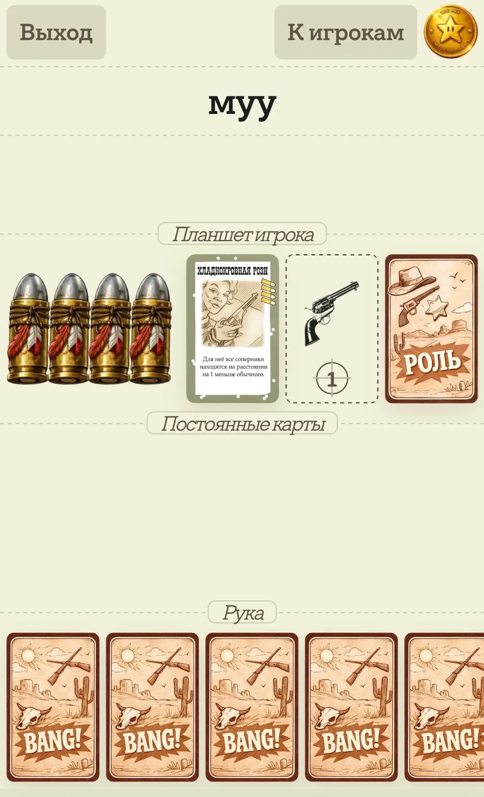

# [Карманная настольная игра BANG](https://bang.cyberqostya.ru/)

Мобильная realtime-игра/помощник для партии в стиле BANG!, где игроки садятся за общий стол, получают скрытые роли, персонажей и карты, а затем пытаются выполнить свою цель через блеф, риск, реакции и грамотное управление рукой.

Проект сделан с фокусом на быстрый вход в партию: создать комнату, занять место, получить роль и сразу играть без лишних настроек. Интерфейс рассчитан на телефон, чтобы его можно было использовать прямо за столом или как самостоятельную браузерную игру.

## Скриншоты

### Общий экран партии

Главный экран показывает стол игроков, текущие статусы, здоровье, дальность, общий чат событий и нижнюю панель хода. Активный игрок читается не только по тексту, но и через подсветку стола, статусное кольцо и связь с фазами хода.

### Планшет своего персонажа и реакция

Экран планшета игрока собирает личную информацию в одном месте: персонаж, роль, оружие, здоровье и рука. Поверх интерфейса показывается реакция на атаку Bang, чтобы игрок сразу понял, что он стал целью и должен ответить.

### Выбор карты в Магазине

Магазин вынесен в отдельный понятный режим выбора: игрок видит доступные карты, текущую очередь выбора и таймер, поэтому групповое действие не превращается в спор о том, кто сейчас должен нажимать.

### База карт и описание эффекта

В проекте есть справочник карт и персонажей. Карта открывается с изображением и описанием эффекта, чтобы игрок мог быстро уточнить правило, не выходя из интерфейса игры.

### Планшет другого игрока

При просмотре чужого планшета интерфейс показывает только публичную информацию: персонажа, оружие, здоровье, количество карт и закрытые роли/руку. Это сохраняет скрытую информацию, но оставляет достаточно данных для тактических решений.

## Продуманные детали интерфейса

В проекте много маленьких UX-решений, которые не бросаются в глаза как отдельные фичи, но помогают игрокам быстрее читать партию и меньше ошибаться:

- Активный игрок подсвечивается на столе "фонарем": направление света вычисляется от центра стола к его статусной зоне, поэтому взгляд сразу понимает, чей сейчас ход.
- У ходящего игрока подсвечивается и анимируется пунктирное кольцо статусов. Оно связано по цвету с анимированными линиями на панели фаз хода, поэтому стол и нижний интерфейс визуально говорят об одном и том же состоянии.
- Постоянные карты видны не только в ленте событий: когда игрок кладет Прицел, Мустанга, Бочку, Тюрьму или Динамит, у него сразу появляется отдельная иконка статуса вокруг персонажа.
- Статусы, здоровье и дальность разнесены вокруг игрока по круговой сетке, поэтому важная информация не слипается в одну строку и остается читаемой даже на телефоне.
- Каждый игрок получает индивидуальную шляпу. Это помогает запоминать людей за столом не только по имени, но и по визуальному силуэту.
- Шериф дополнительно маркируется отдельной подписью "Шериф", но имя игрока остается свободным: можно ввести любое имя, даже "Шериф", и интерфейс все равно корректно отделит роль от имени.
- В сообщениях, заголовке хода и событиях шериф упоминается с префиксом роли, чтобы публичная роль не терялась в тексте партии.
- При выборе карты интерфейс сам переводит игрока в нужный режим: если нужна цель, открывается стол игроков; если цель недоступна по дистанции или правилам, ее нельзя нажать.
- Цели подсвечиваются прицелом, а не только доступностью кнопки, поэтому игроку легче понять, кого именно можно атаковать или выбрать.
- Длинные имена аккуратно прокручиваются внутри своего места, не ломая посадку и не перекрывая статусы.
- Потерянные патроны не исчезают полностью, а становятся приглушенными. Игрок видит и текущее здоровье, и максимальный запас.
- Реакции, проверки и выборы показываются отдельными оверлеями с прогрессом времени, чтобы напряженные моменты партии не растворялись в общем чате.

## Для игроков

### Главная идея

Каждый игрок получает роль и персонажа. Шериф известен всем, остальные роли скрыты: бандиты охотятся на шерифа, помощники защищают закон, а ренегат пытается остаться последним выжившим. Победа зависит не только от карт, но и от чтения поведения игроков, правильного момента для атаки и умения скрывать свои намерения.

### Что уже есть в игре

- Онлайн-комнаты с паролем и посадкой игроков за стол до 8 мест.
- Автоматическая раздача ролей, персонажей, стартовых карт и здоровья.
- Скрытые роли с публичным шерифом и раскрытием ролей в конце партии.
- Пошаговая структура хода: проверки, добор, розыгрыш карт, сброс лишних карт.
- Система здоровья через патроны и ограничение руки по текущему здоровью.
- Дистанция между игроками с учетом позиции за столом, оружия, Прицела, Мустанга и способностей персонажей.
- Карты атаки, защиты и реакции: Bang, Missed, Gatling, Indians, Duel, Beer и другие.
- Постоянные карты на столе: оружие, Прицел, Мустанг, Бочка, Тюрьма, Динамит.
- Реакции с таймерами: игроки видят, кто должен ответить, сколько времени осталось и какая карта нужна.
- Проверки карт для Бочки, Тюрьмы и Динамита.
- Магазин с поочередным выбором карт и таймером выбора.
- Персонажи с уникальными способностями: дополнительный добор, изменение дистанции, особые проверки, лечение за сброс, возврат сыгранных карт, усиленные реакции и другие эффекты.
- Лента событий, которая фиксирует важные действия партии и помогает не потерять контекст.
- Звуки карт и визуальные состояния, чтобы действия ощущались заметнее и понятнее.
- Переподключение игрока к своей комнате после разрыва соединения.

### UX и гейм-дизайн

Проект собирался как удобный игровой интерфейс, а не просто техническая реализация правил. Поэтому в нем много решений, направленных на понятность партии:

- Игрок видит только те действия, которые сейчас реально доступны.
- Разыгрываемые карты сами переводят интерфейс в нужный режим выбора цели.
- Чужие закрытые данные не показываются, но количество карт, здоровье, оружие и статусы доступны для принятия решений.
- Текущий ход, реакции, проверки и выборы выделяются отдельными уведомлениями.
- Состояния на столе визуализированы через карты, статусы, патроны и роли, чтобы игроку не приходилось держать все в голове.
- Интерфейс спроектирован mobile-first: крупные зоны нажатия, нижняя панель руки, быстрый переход между картами и столом игроков.
- Ошибочные действия блокируются правилами на сервере и подсказками в интерфейсе.

## Для разработчиков

### Технологии

- Vue 3 для интерфейса.
- Pinia для клиентского состояния комнаты и игрока.
- Vite для сборки фронтенда.
- Node.js и `ws` для WebSocket-сервера.
- Общие игровые конфиги в `shared`, которые используются и клиентом, и сервером.
- PM2/nginx deployment описан отдельно в [DEPLOY.md](DEPLOY.md).

### Архитектура

Ключевой принцип проекта: сервер является источником правды. Клиент отправляет намерение игрока, а сервер проверяет правила, меняет состояние комнаты и рассылает всем участникам публичную версию состояния.

Что особенно важно в реализации:

- Изолированные комнаты с лимитами, паролями, ведущим игроком и жизненным циклом партии.
- Серверная проверка игровых правил: чей ход, можно ли сыграть карту, нужна ли цель, хватает ли дистанции, можно ли реагировать.
- Отдельная сериализация публичного состояния: игрок видит свою руку и доступные действия, но не получает закрытые карты и роли других игроков.
- Конфигурационный подход к картам, ролям и персонажам: свойства карт описываются в `shared/cardConfig.js`, персонажи в `shared/characterConfig.js`, роли в `server/roles.js`.
- Общая логика дистанции и статусов вынесена в `shared/gameRules.js`, чтобы клиент и сервер не расходились в расчетах.
- Реакции и отложенные выборы реализованы через pending-состояния и таймеры: атаки, Бочка, Магазин, проверки персонажей, Тюрьма и Динамит.
- Колода, сброс и переработка сброса управляются на сервере, включая сохранение видимых верхних карт сброса.
- Система событий отделена от состояния руки и стола, поэтому UI может показывать историю партии без раскрытия лишней информации.
- Компоненты интерфейса разделены по игровым зонам: стол игроков, зона карт, рука, синяя зона, уведомления реакций, выбор карт, роли и оружие.
- Composable-функции используются для повторяемой UI-логики: результат игры, заголовок приложения, реакции, долгий тап, анимации ухода карт.

### Интересные игровые системы

- Механика скрытых команд с разными условиями победы.
- Автоматический расчет дистанции по круговому столу.
- Ограничение на один Bang за ход и способы временно обойти его через Volcanic и способности.
- Реакции с частичным прогрессом, когда некоторым персонажам нужно больше одной защитной карты.
- Активные и пассивные способности персонажей, влияющие на добор, проверки, лечение, дистанцию и обмен картами.
- Проверки верхней карты колоды для эффектов риска: Бочка может спасти от атаки, Тюрьма может пропустить ход, Динамит может взорваться или перейти дальше.
- Учет смерти игрока, сброса его карт, передачи карт через способность и автоматической проверки победы.

## Структура проекта

- `src/screens` - основные экраны: комнаты, посадка за стол, игровой экран.
- `src/components` - переиспользуемые UI-компоненты игрового интерфейса.
- `src/stores/roomStore.js` - клиентское состояние WebSocket-подключения, комнаты и действий игрока.
- `server/gameServer.js` - основная серверная логика комнат, ходов, карт, реакций и победы.
- `server/cards.js` - состав колоды и масти.
- `server/roles.js` - роли и раздача ролей по количеству игроков.
- `shared/cardConfig.js` - описание карт и их игровых свойств.
- `shared/characterConfig.js` - персонажи и их способности.
- `shared/gameRules.js` - общие правила, включая расчет дистанции.
- `shared/timingConfig.js` - общие тайминги реакций и выборов.

## Портфолио-фокус

Этот проект показывает не только умение собрать realtime-приложение, но и работу с игровым дизайном: формализацию правил, проектирование состояний, UX для сложной пошаговой игры, защиту от неправильных действий, визуальную читаемость стола и поддержку темпа партии через таймеры, события и понятные подсказки.
